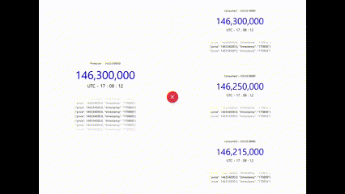
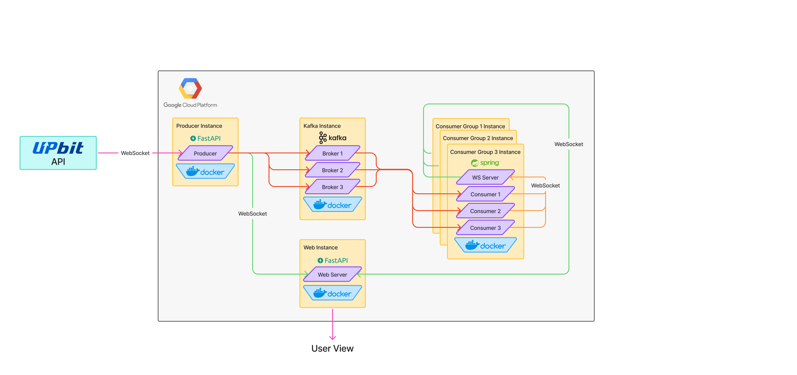

# 🚀 Kafka 기반 WebSocket 실시간 비트코인 체결 정보 프로젝트

## **1️⃣ 프로젝트 소개 📝**

이 프로젝트는 **Kafka를 활용하여 비트코인 체결 정보를 실시간으로 수집하고, WebSocket을 통해 클라이언트에 전달하는 스트리밍 데이터 처리 시스템**입니다.  
**GCP VM에서 Kafka Broker, WebSocket 서버, 컨슈머 그룹을 실행하여 대규모 트래픽에도 확장 가능한 구조를 구현**하였습니다.

## **2️⃣ 학습 목표 🎯**

이 프로젝트를 통해 다음을 학습할 수 있습니다:

- **Kafka의 핵심 개념 (토픽, 파티션, 컨슈머 그룹, 브로커)**
- **Kafka를 마이크로서비스에서 활용하는 방법**
- **Kafka를 활용한 데이터 스트리밍 아키텍처**
- **Docker + Kafka + WebSocket을 활용한 실시간 데이터 처리 시스템 구축**
- **GCP VM에서 Kafka 기반 마이크로서비스를 배포하는 방법**
- **WebSocket을 활용한 실시간 대시보드 구축**

## **3️⃣ 아키텍처 🏗️**

프로젝트는 **Kafka와 WebSocket을 활용하여 실시간 스트리밍 데이터를 처리하는 구조**로 설계되었습니다.  
Kafka 컨슈머가 `stock-trade-group` 컨슈머 그룹을 통해 데이터를 처리하며, WebSocket 서버를 통해 클라이언트 및 대시보드 서버로 전달됩니다.

### **🔹 주요 아키텍처 구성**

|구성 요소|역할 및 설명|
|---|---|
|**Kafka Producer (1개)**|WebSocket API에서 비트코인 체결 정보를 실시간으로 받아 Kafka의 `stock_trade` 토픽으로 전송|
|**Kafka Broker (3개, VM 1대에서 실행)**|Producer가 보낸 `stock_trade` 토픽을 관리하며, 3개의 파티션으로 데이터를 분배|
|**Kafka Consumer Group (3개, 각 VM에서 실행)**|컨슈머 그룹(`stock-trade-group`) 3개가 각각 다른 VM에서 실행되며, 각 컨슈머 그룹 내 3개의 컨슈머가 파티션을 하나씩 소비|
|**WebSocket 서버 (3개, 각 Consumer Group과 함께 실행)**|각 컨슈머 그룹에서 실행되며, 컨슈머들이 데이터를 WebSocket 서버의 REST API로 보내고, 서버는 연결된 클라이언트 및 대시보드에 실시간 전송|
|**Dashboard 서버 (1개)**|WebSocket 서버와 연결되어 실시간 체결 정보를 모니터링할 수 있는 대시보드를 제공|

📌 **GCP VM에서 실행 중인 서버**

- **Kafka Producer 서버 (1개)** → 실시간 비트코인 체결 정보 수집
- **Kafka Broker 서버 (3개, 1개의 VM에서 실행)** → Kafka 토픽 데이터 관리 (도커 컴포즈로 실행)
- **Consumer Group 서버 (3개, 각 VM에서 실행, 내부에 4개 컨테이너 실행)**
    - **WebSocket Server (8080 포트)**
    - **Consumer 1 (8081 포트)**
    - **Consumer 2 (8082 포트)**
    - **Consumer 3 (8083 포트)**
- **Dashboard 서버 (1개)** → 체결 정보 모니터링

## **4️⃣ 카프카 핵심 요소(Producer, Broker, Consumer) 🏗️**

### **🔹 1. 프로듀서 (Kafka Producer) 구현 및 동작 방식**

**프로듀서는 WebSocket을 통해 비트코인 체결 정보를 수집하고 Kafka로 전송하는 역할을 수행합니다.**

- WebSocket API를 이용하여 **비트코인 체결 정보를 실시간으로 받아 Kafka의 `stock_trade` 토픽으로 전송**합니다.
- **Kafka의 브로커가 데이터를 저장하고, 파티션을 통해 컨슈머에게 데이터를 분배합니다.**

📌 **구현 방식**

- WebSocket을 통해 체결 정보를 수집 (`체결가`, `체결 시간` 등)
- Kafka Producer를 사용하여 `stock_trade` 토픽으로 메시지를 발행
- **Kafka Broker 서버가 데이터를 관리하고 컨슈머에게 분배함**

---

### **🔹 2. 브로커 (Kafka Broker) 구현 및 동작 방식**

**Kafka 브로커는 프로듀서가 보낸 메시지를 관리하고, 컨슈머에게 전달하는 역할을 합니다.**

- `stock_trade` 토픽을 관리하며, **총 3개의 파티션을 통해 컨슈머에게 데이터를 분배**합니다.
- **GCP VM 내에서 Kafka Broker 3개를 도커 컴포즈로 실행하여 분산 환경에서 동작**하도록 구성했습니다.

📌 **브로커의 핵심 역할**

- **토픽 데이터 저장 및 관리**
    - `stock_trade` 토픽을 생성하고, **3개의 파티션으로 나누어 데이터 저장**
- **컨슈머 그룹에 데이터 분배**
    - `stock-trade-group`에 속한 각 컨슈머 그룹이 3개의 컨슈머를 실행하여 각 파티션을 담당
- **컨슈머 장애 발생 시 자동 복구**
    - 특정 컨슈머가 다운되면, 남은 컨슈머가 파티션을 재할당받아 데이터를 소비

📌 **브로커 동작 방식**

- **Kafka 토픽 생성**
- **토픽을 3개의 파티션으로 분배**
- **컨슈머 그룹이 데이터를 가져갈 수 있도록 관리**
- **컨슈머가 장애 발생 시 자동 복구 기능 제공**

---

### **🔹 3. 컨슈머 (Kafka Consumer) 구현 및 동작 방식**

**Kafka 컨슈머는 브로커에서 데이터를 소비하고 WebSocket 서버로 전송하는 역할을 수행합니다.**

- **각 Consumer Group 서버에서 3개의 컨슈머를 실행**
- **각 컨슈머 그룹은 `stock-trade-group`에 속하여, Kafka가 자동으로 각 컨슈머에 파티션을 분배**
- **각 컨슈머는 `8081`, `8082`, `8083` 포트에서 실행**
- **컨슈머가 메시지를 수신하면 동일한 VM에서 실행되는 WebSocket 서버(`8080`)로 데이터를 REST API를 통해 전송**
- **WebSocket 서버는 대시보드 서버 및 클라이언트에 데이터를 브로드캐스트**

📌 **컨슈머 그룹을 사용한 장점**

- **부하 분산**: 3개의 컨슈머 그룹이 각각 3개의 컨슈머를 실행하여 **고른 로드 밸런싱을 유지**
- **확장성**: 컨슈머 그룹을 추가하면 **파티션이 동적으로 재할당되어 확장 가능**
- **장애 복구**: 컨슈머가 다운되면, 남은 컨슈머가 자동으로 파티션을 인계받아 **연속적인 데이터 처리가 가능**

---

### **🔹 4. Dashboard 서버 구현 및 동작 방식**

**Dashboard 서버는 각 WebSocket 서버와 연결되어 실시간 체결 정보를 모니터링하는 역할을 수행합니다.**

- WebSocket을 통해 체결 데이터를 수신하고, 차트 및 리스트 형태로 시각화
- **실시간으로 컨슈머가 처리한 데이터를 확인 가능**
- **대규모 트래픽 시 Kafka의 부하 분산 효과를 모니터링할 수 있도록 구성**

📌 **Dashboard 서버 역할**

- Kafka 데이터를 WebSocket을 통해 실시간으로 수신
- 차트 및 그래프를 통해 데이터 시각화
- **Kafka 시스템의 성능 및 상태를 모니터링하는 기능 추가 가능**

## **5️⃣ 발표 자료 🖥️**
[ 👉 Kafka에 대한 이해](/Team2_Kafka_Presentation.pdf)

## **6️⃣ 프로젝트 고찰 🤔**

✅ **Kafka의 확장성과 유연성을 경험**  
✅ **GCP VM에서 Kafka 기반 시스템을 운영하며 실무 적용 가능성 확인**  
✅ **WebSocket을 이용한 실시간 데이터 스트리밍 및 대시보드 모니터링 경험**  
✅ **컨슈머 그룹을 활용한 부하 분산 및 장애 대응 방식 이해**  
✅ **Docker Compose를 이용한 서비스 배포 자동화 실습**

---

## **📌 마무리 🎯**

이 프로젝트를 통해 Kafka의 기본 개념부터 **실시간 데이터 스트리밍을 위한 마이크로서비스 배포까지** 경험할 수 있었습니다.

💡 **향후 추가할 기능:**

- Kafka 메시지 로그 저장 (ELK 스택 연계)
- Kafka 스트림을 활용한 데이터 필터링 및 변환
- Kubernetes를 활용한 완전한 분산 운영
